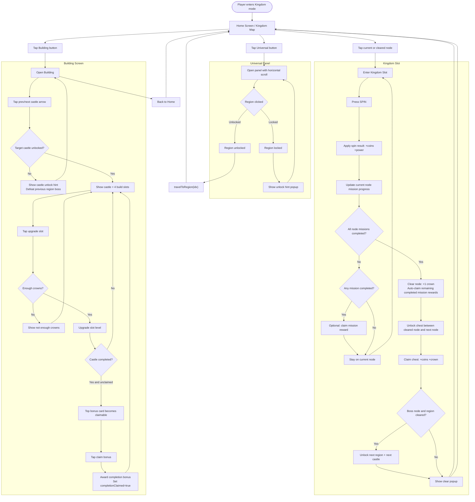

# Kingdom Mode Flow

## Core Rules
- Region order: `Home -> Forest -> Desert -> Snow -> Volcano`.
- Region/castle unlock rule: clear boss of region `i` to unlock region `i+1` and castle `i+1`.
- Building bonus rule: completion bonus is manual claim (one-time per region castle).
- Reward chest rule: mỗi đường nối `node i -> node i+1` có một chest, unlock khi clear `node i`, claim 1 lần.
- Node clear rule (mission-only): clear node khi toàn bộ mission của node hiện tại ở trạng thái `completed` hoặc `claimed`.
- Mission reward carry rule: mission đã `completed` nhưng chưa claim sẽ auto-claim khi node clear.
- Node mission count rule (demo): `Home=1`, `Forest=2`, `Desert/Snow/Volcano=3` mission mỗi node.
- Node mission difficulty rule (demo): nhiệm vụ dễ, hoàn thành nhanh trong vài spin.
