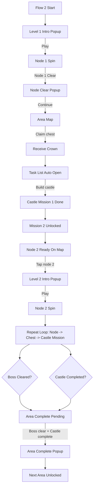

# Plan: Flow 2 - Onboarding Theo Loop Area / Node / Chest / Castle

## Mục tiêu
Điều chỉnh `Flow 2` để bám các yếu tố đã có sẵn trong build hiện tại:
- Mỗi `area` được chơi theo tuyến `node`.
- Node vào `spin` chơi bình thường.
- Reward meta nằm trong `chest`, và reward đó là `crown`.
- Mỗi `area` có đúng `1 castle`, nhưng castle đó được xây qua nhiều nhiệm vụ nối tiếp.
- Qua `area` khi đồng thời đạt `boss clear + castle complete`.

Flow này vẫn giữ tinh thần sequence của ảnh mẫu, nhưng phần lõi sẽ bám loop hiện tại của game thay vì tách sang một minigame khác.

## Quyết định Flow Đã Chốt
1. Node được chơi bằng loop `spin` như hiện tại, không đổi sang kiểu chơi khác.
2. Reward meta không dùng `star`; reward dùng để build là `crown`.
3. Crown không rơi trực tiếp từ node; crown nằm trong `chest`.
4. Claim `chest` là `manual`.
5. Build `castle` là `manual`.
6. Mỗi `area` chỉ có `1 castle`.
7. `1 castle` sẽ được build nhiều lần qua chuỗi nhiệm vụ mở dần.
8. Mỗi thời điểm chỉ có `1 build mission` của castle ở trạng thái active.
9. Hoàn tất nhiệm vụ hiện tại thì mới mở nhiệm vụ build tiếp theo.
10. Unlock/complete area theo rule: `boss clear + castle complete`.

## Rule Nhiệm Vụ Castle
Castle không phải một action build đơn lẻ. Castle là một chuỗi mission build tuần tự trong cùng 1 area.

Rule flow:
1. Mỗi `area` có một danh sách `castle build mission`.
2. Ban đầu chỉ mission đầu tiên được mở.
3. Người chơi hoàn tất mission hiện tại bằng thao tác build thủ công.
4. Sau khi mission hiện tại hoàn tất:
   - mission đó chuyển `done`
   - mission kế tiếp mới chuyển `active`
5. Không có 2 mission build active cùng lúc.
6. `Castle completed` chỉ xảy ra khi mission cuối cùng của castle được hoàn tất.

Demo area đầu của Flow 2 có đúng `2 mission`:
1. Mission đầu: `Build castle`
2. Mission kế tiếp: `Build the fountain`

Trong MVP của Flow 2, demo area đầu dừng ở 2 mission này. Mission bổ sung cho area khác không nằm trong phạm vi plan hiện tại.

Ý nghĩa UX:
- Người chơi không bị overwhelm vì chỉ học từng bước.
- Castle vẫn là một mục tiêu thống nhất, nhưng được chia thành các hành động nhỏ để làm quen dần.

## Flow Loop Cốt Lõi Trong Một Area
1. Người chơi vào `area`.
   - Thấy tuyến node của area hiện tại.
   - Thấy castle duy nhất của area đó.
   - Chỉ `current node` là node được chơi.
2. Người chơi bấm node active để vào màn `spin`.
   - Đây là gameplay chính.
   - Chơi node theo loop bình thường.
3. Khi clear node:
   - Node chuyển sang `cleared`.
   - `Chest` tương ứng được mở khóa.
   - Chưa cộng crown ngay ở bước clear node.
4. Người chơi quay về map/area.
   - Thấy chest ở trạng thái `claimable`.
   - Đây là reward point chính của meta loop.
5. Người chơi tự bấm mở chest.
   - Nhận `crown`.
   - Crown là tài nguyên để build castle của area hiện tại.
6. Người chơi tự bấm vào castle.
   - Dùng crown để hoàn tất `build mission` đang active của castle.
   - Đây là hành động bắt buộc theo hướng dẫn onboarding.
   - Xong mission hiện tại thì mission kế tiếp mới mở ra.
7. Quay về map.
   - Node tiếp theo trở thành `active`.
   - Loop lặp lại cho tới boss node.

## Flow Hoàn Tất Area
1. Người chơi clear boss node của area.
2. Người chơi claim chest còn lại của area nếu có.
3. Người chơi hoàn tất toàn bộ chuỗi build mission của castle bằng crown đã tích lũy.
4. Chỉ khi đủ cả 2 điều kiện sau thì area mới được xem là hoàn tất:
   - `Boss node cleared`
   - `Castle completed`
5. Khi area hoàn tất:
   - Hiện popup complete area.
   - Unlock area tiếp theo.
   - Castle của area tiếp theo xuất hiện ở trạng thái khởi tạo.

## Vai Trò Của Task List Trong Flow 2
Task list không phải loop chính. Task list chỉ là lớp dẫn hướng để dạy người chơi sequence meta.

Task list nên mirror đúng action đang cần làm tiếp theo:
1. `Play current node`
2. `Claim chest reward`
3. `Build current castle mission`
4. `Play next node`
5. `Build next castle mission` khi mission mới được mở

Trong onboarding thực tế:
- Không cần show toàn bộ mission của castle cùng lúc.
- Chỉ nên có `1 primary mission` đang actionable.
- Mission đã done vẫn hiển thị để người chơi thấy tiến trình học/build đang mở dần.

## Onboarding Sequence Khuyến Nghị Cho Flow 2
Sequence này giữ tinh thần ảnh mẫu nhưng thay reward/build logic theo các quyết định mới.

1. `Level 1 Intro`
   - Popup level xuất hiện.
   - Nút `Play`.
2. `Play Node 1`
   - Vào node đầu tiên bằng màn spin bình thường.
3. `Node 1 Clear`
   - Hiện popup `Well Done`.
   - Thông điệp chính: node đã clear, chest đã mở khóa.
4. `Return To Area Map`
   - Map area hiện ra lại.
   - Chest giữa node hiện tại và node kế tiếp ở trạng thái `claimable`.
5. `Claim Chest`
   - Người chơi manual mở chest.
   - Nhận crown.
6. `Task List Auto Open`
   - Sau khi claim chest xong, task list tự mở.
   - Task list hiển thị mission đầu tiên của castle là CTA chính.
7. `Build Castle Mission 1`
   - Không yêu cầu người chơi tự đi tìm task list.
   - Theo ảnh hiện tại, mission này là `Build castle`.
   - Người chơi manual build mission đầu tiên.
8. `Mission 2 Unlocked`
   - Sau khi mission đầu hoàn tất, task đầu chuyển `done`.
   - Mission tiếp theo mới mở ra.
   - Theo ảnh hiện tại, mission tiếp theo là `Build the fountain`.
9. `Next Node Ready`
   - Sau build đầu tiên, node kế tiếp sẵn sàng là bước chơi tiếp theo trên map.
10. `Tap Node 2`
   - Khi người chơi bấm node 2, mới hiện `Level 2` popup.
11. `Level 2 Intro`
   - Popup `Level 2` chỉ xuất hiện ở thời điểm này.

## Mapping Flow 2 Theo Step
1. `flow2_level1_intro`
   - Popup `Level 1`.
2. `flow2_node1_spin`
   - Vào spin để chơi node đầu tiên.
3. `flow2_node1_cleared`
   - Popup clear node.
4. `flow2_area_map_chest_ready`
   - Quay về map, chest đã claimable.
5. `flow2_claim_chest_guided`
   - Sau khi claim chest, task list tự mở để dẫn sang build mission đầu tiên.
6. `flow2_castle_mission1_guided`
   - Task list đang mở với mission build đầu tiên của castle là CTA chính.
7. `flow2_castle_mission2_unlocked`
   - Mission 1 `done`, mission 2 mới `active`.
8. `flow2_node2_ready`
   - Node kế tiếp active.
9. `flow2_level2_intro`
   - Popup `Level 2` chỉ hiện khi người chơi bấm node 2.
10. `flow2_node2_spin`
   - Vào spin để chơi node 2.

## Flow Spec Theo Từng Màn
### 1. `Level Intro Popup`
Mục đích:
- Giới thiệu level sắp chơi.
- Tạo nhịp vào level rõ ràng như ảnh mẫu.

Nội dung chính:
- Tên level: `Level 1`, `Level 2`, ...
- `Goal`
- Booster row
- CTA chính: `Play`

Hành động:
- `Play`: vào node spin tương ứng của level hiện tại.
- `Close`: không khuyến nghị cho Flow 2 onboarding; nên hạn chế để tránh lệch flow.

Điều kiện chuyển màn:
- `Play` -> `Spin Screen`

### 2. `Area Map`
Mục đích:
- Là hub chính của area.
- Cho người chơi thấy cùng lúc `node tuyến tiến trình`, `chest`, và `castle`.

Nội dung chính:
- Danh sách node của area theo tuyến.
- Chest nằm giữa các node.
- Castle duy nhất của area.
- Optional: task indicator hoặc task button.

Trạng thái hiển thị:
- Node:
  - `locked`
  - `active`
  - `cleared`
- Chest:
  - `locked`
  - `claimable`
  - `claimed`
- Castle:
  - `mission_active`
  - `completed`

Hành động:
- Bấm `active node` -> vào `Spin Screen`
- Bấm `claimable chest` -> nhận crown
- Bấm `castle` -> vào `Castle Screen`
- Bấm `task list` -> mở `Task List Panel`

Rule onboarding:
- Khi chest đang là action tiếp theo, cần ưu tiên dẫn vào chest trước.
- Khi castle mission đang là action tiếp theo, cần ưu tiên dẫn vào castle trước.
- Có thể cho bấm các thành phần khác, nhưng không nên để phá nhịp chính của onboarding.

Điều kiện chuyển màn:
- `active node` -> `Spin Screen`
- `claimable chest` -> ở lại `Area Map`, cập nhật reward/state
- `castle` -> `Castle Screen`
- `task list` -> `Task List Panel`

### 3. `Spin Screen`
Mục đích:
- Màn gameplay chính cho từng node.
- Node vẫn chơi bằng loop spin bình thường.

Nội dung chính:
- Header node/level
- Slot/spin gameplay
- CTA chính: `Spin`

Hành động:
- Chơi spin cho đến khi node clear.
- Back về map:
  - Chỉ nên cho phép khi không phá progress onboarding.
  - Nếu quay về sớm, node vẫn chưa clear thì action tiếp theo vẫn là node đó.

Điều kiện chuyển màn:
- Node chưa clear -> ở lại `Spin Screen`
- Node clear -> `Node Clear Popup`

### 4. `Node Clear Popup`
Mục đích:
- Tách khoảnh khắc clear node khỏi khoảnh khắc nhận reward meta.
- Dạy người chơi rằng clear node sẽ mở chest, không phải cộng crown trực tiếp.

Nội dung chính:
- `Well Done`
- Thông điệp: node đã clear
- Thông điệp phụ: `Chest unlocked`
- CTA chính: `Continue`

Hành động:
- `Continue` -> quay về `Area Map`

Rule:
- Không hiển thị crown reward trực tiếp ở popup này.
- Popup này chỉ xác nhận clear node và mở khóa chest.

Điều kiện chuyển màn:
- `Continue` -> `Area Map`

### 5. `Chest Claim State`
Mục đích:
- Tạo khoảnh khắc nhận crown riêng biệt.
- Là cầu nối giữa gameplay node và progress castle.

Nội dung chính:
- Chest trên map đổi sang `claimable`
- Reward preview nếu cần: crown amount

Hành động:
- Bấm chest để claim crown

Kết quả sau claim:
- Chest chuyển `claimed`
- Crown được cộng vào ví crown
- Task list tự mở
- Action tiếp theo chuyển sang `build current castle mission`

Điều kiện chuyển màn:
- Claim xong:
  - auto mở `Task List Panel`
  - task build đầu tiên trở thành CTA chính

### 6. `Task List Panel`
Mục đích:
- Là lớp dẫn hướng, không phải hub chính.
- Cho người chơi thấy `current objective` của castle đang mở dần.

Nội dung chính:
- Header `Castle`
- Danh sách mission build theo thứ tự
- Chỉ 1 mission ở trạng thái actionable

Trạng thái mission:
- `locked`
- `active`
- `done`

Theo ảnh hiện tại:
1. `Build castle`
2. `Build the fountain`

Rule hiển thị:
- Mission đầu active trước.
- Xong mission đầu:
  - mission đầu chuyển `done`
  - mission tiếp theo mới chuyển `active`
- Không mở cùng lúc nhiều mission build.

Hành động:
- Bấm mission `active` -> vào `Castle Screen`
- Mission `done` chỉ hiển thị trạng thái, không còn CTA chính
- Mission `locked` không bấm được

Điều kiện chuyển màn:
- `active mission` -> `Castle Screen`
- `close` -> quay lại `Area Map`

### 7. `Castle Screen`
Mục đích:
- Nơi thực hiện build thủ công cho mission castle hiện tại.
- Castle là một thực thể duy nhất nhưng tiến triển qua nhiều mission nối tiếp.

Nội dung chính:
- Castle visual ở trạng thái hiện tại
- Tên mission đang active
- Cost bằng crown
- CTA chính: `Build`

Rule:
- Chỉ mission current mới được build.
- Build thành công:
  - mission hiện tại -> `done`
  - mission kế tiếp -> `active` nếu còn
  - castle visual tiến thêm một bước
- Chưa xong mission cuối thì castle chưa `completed`

Hành động:
- `Build`
- `Back`

Điều kiện chuyển màn:
- Build xong mission nhưng còn mission tiếp -> quay về `Task List Panel` hoặc `Area Map`
- Build xong mission cuối -> castle chuyển `completed`
- `Back` -> quay về nơi mở vào trước đó

### 8. `Level 2 Intro Popup`
Mục đích:
- Giữ pacing theo ảnh reference.
- Xác nhận người chơi đã đi qua node -> chest -> castle mission đầu tiên.

Thời điểm xuất hiện khuyến nghị:
- Sau khi hoàn tất mission đầu tiên của castle
- Và chỉ khi người chơi bấm node tiếp theo trên map

Nội dung chính:
- `Level 2`
- `Goal`
- Booster row
- CTA: `Play`

Điều kiện chuyển màn:
- `Play` -> `Spin Screen` của node tiếp theo

### 9. `Area Complete Popup`
Mục đích:
- Xác nhận người chơi đã hoàn tất cả gameplay loop và meta loop của area.

Điều kiện để được show:
- `boss clear`
- `castle completed`

Nội dung chính:
- `Area Complete`
- Xác nhận area kế tiếp được mở
- CTA: `Continue`

Điều kiện chuyển màn:
- `Continue` -> `Area Map` của area kế tiếp hoặc màn home tương ứng

## Flow Chuyển Màn Chính
1. `Level Intro Popup`
   - `Play` -> `Spin Screen`
2. `Spin Screen`
   - clear node -> `Node Clear Popup`
3. `Node Clear Popup`
   - `Continue` -> `Area Map`
4. `Area Map`
   - chest claimable -> `Claim chest`
5. `Claim chest`
   - crown nhận xong -> auto mở `Task List Panel`
6. `Task List Panel`
   - bấm mission active -> `Castle Screen`
7. `Castle Screen`
   - build mission 1 xong -> `Task List Panel` với mission 2 mở ra
8. `Area Map`
   - node kế tiếp active -> bấm node mới tới `Level 2 Intro Popup`
9. `Level 2 Intro Popup`
   - `Play` -> `Spin Screen` của node kế tiếp
10. `Area Complete Popup`
   - chỉ show khi đủ `boss clear + castle complete`

## Rule Gating Trong Onboarding
1. Sau khi clear node đầu tiên, action kế tiếp phải là `claim chest`.
2. Sau khi claim chest đầu tiên, task list phải tự mở.
3. Khi task list tự mở, action kế tiếp phải là `build mission` đầu tiên của castle.
4. Sau khi build mission đầu tiên:
   - mission đầu chuyển `done`
   - mission tiếp theo mới lộ ra
   - node tiếp theo được coi là nhịp chơi tiếp theo trên map
5. `Level 2 Intro Popup` chỉ hiện khi người chơi bấm node tiếp theo.
6. Không nên dồn nhiều CTA ngang nhau trong cùng một thời điểm đầu onboarding.
7. Ở giai đoạn đầu, UI nên luôn có một `primary next action` rõ ràng.

## Nội Dung Task List Khuyến Nghị Cho Flow 2
### Giai đoạn đầu onboarding
1. `Build castle`
   - `active`
2. `Build the fountain`
   - `locked`

### Sau khi hoàn tất mission đầu
1. `Build castle`
   - `done`
2. `Build the fountain`
   - `active`

### Phạm vi mission của demo area đầu
1. `Build castle`
   - `done` sau mission đầu
2. `Build the fountain`
   - `active` sau mission đầu

Demo area đầu chỉ chốt 2 mission này trong MVP hiện tại.

## State Matrix Cho Flow 2
### 1. `flow2_level1_intro`
- Entry condition:
  - Người chơi vừa vào Flow 2.
- Visible UI:
  - `Level 1 Intro Popup`
- Primary CTA:
  - `Play`
- Allowed secondary actions:
  - Không nên có thêm CTA quan trọng khác.
- Blocked actions:
  - Mở task list
  - Vào castle
  - Chọn node khác
- Success event:
  - `level1_play_clicked`
- Next state:
  - `flow2_node1_spin`

### 2. `flow2_node1_spin`
- Entry condition:
  - Người chơi đã bấm `Play` ở popup `Level 1`.
- Visible UI:
  - `Spin Screen` của node 1
- Primary CTA:
  - `Spin`
- Allowed secondary actions:
  - Back về map chỉ khi không phá flow; nếu back thì node 1 vẫn là action chính.
- Blocked actions:
  - Claim chest
  - Build castle mission
  - Chơi node khác
- Success event:
  - `node1_cleared`
- Next state:
  - `flow2_node1_cleared`

### 3. `flow2_node1_cleared`
- Entry condition:
  - Node 1 vừa clear.
- Visible UI:
  - `Node Clear Popup`
  - Thông điệp `Chest unlocked`
- Primary CTA:
  - `Continue`
- Allowed secondary actions:
  - Không nên có.
- Blocked actions:
  - Build castle trực tiếp
  - Vào node tiếp theo
- Success event:
  - `node1_clear_continue_clicked`
- Next state:
  - `flow2_area_map_chest_ready`

### 4. `flow2_area_map_chest_ready`
- Entry condition:
  - Popup clear node đã đóng.
  - Chest đầu tiên đang `claimable`.
- Visible UI:
  - `Area Map`
  - Chest đầu tiên highlight
  - Castle hiển thị nhưng chưa là CTA chính
- Primary CTA:
  - `Claim chest`
- Allowed secondary actions:
  - Mở task list để xem objective
- Blocked actions:
  - Build castle mission trước khi claim chest
  - Vào node 2
- Success event:
  - `first_chest_claimed`
- Next state:
  - `flow2_claim_chest_guided`

### 5. `flow2_claim_chest_guided`
- Entry condition:
  - Chest đầu tiên vừa được claim.
- Visible UI:
  - `Task List Panel` tự mở
  - Crown đã cập nhật
  - Mission 1 là CTA chính
- Primary CTA:
  - `Build castle`
- Allowed secondary actions:
  - `Close` để quay lại map, nhưng CTA chính vẫn là mission 1
- Blocked actions:
  - Vào node 2 trước khi hoàn tất mission build đầu tiên
- Success event:
  - `castle_mission1_opened`
- Next state:
  - `flow2_castle_mission1_guided`

### 6. `flow2_castle_mission1_guided`
- Entry condition:
  - Người chơi đã có crown từ chest đầu tiên.
  - Mission 1 là mission build duy nhất đang active.
- Visible UI:
  - `Task List Panel` hoặc `Castle Screen`
  - Mission 1: `Build castle` = `active`
  - Mission 2: `Build the fountain` = `locked`
- Primary CTA:
  - `Build castle`
- Allowed secondary actions:
  - Close task list để quay lại map, nhưng CTA chính vẫn phải quay về mission 1.
- Blocked actions:
  - Build mission 2
  - Vào node 2
- Success event:
  - `castle_mission1_completed`
- Next state:
  - `flow2_castle_mission2_unlocked`

### 7. `flow2_castle_mission2_unlocked`
- Entry condition:
  - Mission 1 vừa hoàn tất.
- Visible UI:
  - `Task List Panel` update state
  - Mission 1: `done`
  - Mission 2: `active`
- Primary CTA:
  - Trong meta layer: mission 2 đã active.
  - Trong onboarding pacing: `Close` hoặc quay về map để bấm node 2.
- Allowed secondary actions:
  - Người chơi có thể hiểu rằng mission mới đã mở.
- Blocked actions:
  - Không bắt người chơi phải làm mission 2 ngay ở khoảnh khắc này.
- Success event:
  - `mission2_reveal_acknowledged`
- Next state:
  - `flow2_node2_ready`

### 8. `flow2_node2_ready`
- Entry condition:
  - Mission 2 đã được reveal.
  - Node 2 đã sẵn sàng trên map.
- Visible UI:
  - `Area Map` với node 2 active.
  - Task list vẫn giữ:
    - Mission 1 `done`
    - Mission 2 `active`
- Primary CTA:
  - `Tap node 2`
- Allowed secondary actions:
  - Xem task list
  - Vào castle mission 2 nếu muốn cho phép sau bước intro
- Blocked actions:
  - Không có block onboarding cứng như giai đoạn đầu nữa, trừ rule logic chung của area.
- Success event:
  - `node2_tapped`
- Next state:
  - `flow2_level2_intro`

### 9. `flow2_level2_intro`
- Entry condition:
  - Người chơi vừa bấm node 2.
- Visible UI:
  - `Level 2 Intro Popup`
- Primary CTA:
  - `Play`
- Allowed secondary actions:
  - Không nên có thêm CTA ngang hàng.
- Blocked actions:
  - Vào thẳng spin mà không confirm popup
- Success event:
  - `level2_play_clicked`
- Next state:
  - `flow2_node2_spin`

### 10. `flow2_node2_spin`
- Entry condition:
  - Người chơi đã bấm `Play` trong popup `Level 2`.
- Visible UI:
  - `Spin Screen` của node 2
- Primary CTA:
  - `Spin`
- Allowed secondary actions:
  - Back về map theo rule gameplay chung
- Blocked actions:
  - Claim chest chưa mở
  - Build mission không liên quan trực tiếp
- Success event:
  - Loop quay lại pattern `node -> chest -> castle mission`.
- Next state:
  - Các state lặp tương tự cho node tiếp theo cho tới boss node.

### 11. `area_complete_pending`
- Entry condition:
  - Boss node đã clear nhưng castle chưa complete, hoặc ngược lại.
- Visible UI:
  - `Area Map`
  - Area chưa complete
  - Hiển thị rõ phần còn thiếu:
    - `Boss not cleared`
    - hoặc `Castle not completed`
- Primary CTA:
  - Làm nốt phần còn thiếu.
- Allowed secondary actions:
  - Xem task list
  - Vào castle
- Blocked actions:
  - Unlock area tiếp theo
- Success event:
  - `boss_clear_and_castle_complete`
- Next state:
  - `area_complete`

### 12. `area_complete`
- Entry condition:
  - Đủ `boss clear + castle complete`
- Visible UI:
  - `Area Complete Popup`
- Primary CTA:
  - `Continue`
- Allowed secondary actions:
  - Không cần thêm.
- Blocked actions:
  - Không cho nhảy state trước khi xác nhận popup.
- Success event:
  - `area_complete_continue_clicked`
- Next state:
  - `next_area_unlocked`

## Ghi Chú Điều Hướng Quan Trọng
1. Giai đoạn onboarding đầu chỉ có một chuỗi CTA bắt buộc:
   - `Play node 1`
   - `Claim chest`
   - `Build castle`
2. Sau khi `Build castle` xong:
   - `Build the fountain` được mở ra ở lớp meta
   - nhưng CTA pacing tiếp theo trên map là `Tap node 2`
3. Như vậy flow vẫn bám ảnh:
   - task list update trước
   - người chơi bấm node 2
   - rồi mới tới popup `Level 2`
4. Từ node 2 trở đi có thể nới gating hơn, miễn không phá rule cốt lõi:
   - chest cho crown
   - castle mission mở tuần tự
   - area complete khi `boss clear + castle complete`

## Flowchart Khuyến Nghị

## Event Map Ở Mức Product
| Event | From state | To state | Ý nghĩa product | Side effect ở mức flow |
| --- | --- | --- | --- | --- |
| `level1_play_clicked` | `flow2_level1_intro` | `flow2_node1_spin` | Người chơi bắt đầu node đầu tiên | Vào gameplay của node 1 |
| `node1_cleared` | `flow2_node1_spin` | `flow2_node1_cleared` | Node 1 hoàn tất | Node 1 = `cleared`, chest 1 = `claimable` |
| `node1_clear_continue_clicked` | `flow2_node1_cleared` | `flow2_area_map_chest_ready` | Quay về map sau clear node | Highlight chest là next action |
| `first_chest_claimed` | `flow2_area_map_chest_ready` | `flow2_claim_chest_guided` | Người chơi manual claim crown đầu tiên | Crown tăng, chest 1 = `claimed`, task list auto mở |
| `castle_mission1_opened` | `flow2_claim_chest_guided` | `flow2_castle_mission1_guided` | Người chơi vào build layer từ task list auto mở | Mission 1 là CTA duy nhất |
| `castle_mission1_completed` | `flow2_castle_mission1_guided` | `flow2_castle_mission2_unlocked` | Hoàn tất bước làm quen build đầu tiên | `Build castle` = `done`, `Build the fountain` = `active` |
| `mission2_reveal_acknowledged` | `flow2_castle_mission2_unlocked` | `flow2_node2_ready` | Xác nhận mission mới đã được mở | Quay lại map với node 2 là next action |
| `node2_tapped` | `flow2_node2_ready` | `flow2_level2_intro` | Người chơi chọn node 2 | Hiện popup `Level 2` |
| `level2_play_clicked` | `flow2_level2_intro` | `flow2_node2_spin` | Người chơi xác nhận vào level 2 | Vào gameplay của node 2 |
| `node_cleared` | `flow2_node2_spin` hoặc loop sau đó | loop clear popup tương ứng | Một node thường được hoàn tất | Chest kế tiếp mở khóa |
| `chest_claimed` | loop map state | loop build-guided state | Người chơi lấy crown từ chest | Tài nguyên build tăng |
| `castle_mission_completed` | loop castle state | loop reveal/update state | Hoàn tất mission build hiện tại | Mission hiện tại = `done`, mission tiếp theo = `active` nếu còn |
| `boss_node_cleared` | loop cuối area | `area_complete_pending` hoặc `area_complete` | Boss node của area đã clear | Đánh dấu điều kiện boss hoàn thành |
| `castle_completed` | loop castle cuối area | `area_complete_pending` hoặc `area_complete` | Mission cuối của castle hoàn tất | Castle = `completed` |
| `boss_clear_and_castle_complete` | `area_complete_pending` | `area_complete` | Đủ điều kiện đóng area | Popup complete area được phép hiển thị |
| `area_complete_continue_clicked` | `area_complete` | `next_area_unlocked` | Người chơi xác nhận qua area mới | Area tiếp theo mở, castle mới khởi tạo |

## Transition Rules Tóm Tắt
1. `Clear node` không tự cộng crown.
2. `Claim chest` mới là điểm nhận crown.
3. `Có crown` không đồng nghĩa `castle complete`; crown chỉ là điều kiện để làm mission build hiện tại.
4. `Build castle mission` luôn đi theo thứ tự.
5. `Mission tiếp theo` chỉ được mở khi mission hiện tại đã `done`.
6. Sau khi `claim chest`, task list phải tự mở.
7. `Level 2 popup` chỉ xuất hiện khi người chơi bấm node tiếp theo.
8. `Area complete` chỉ hợp lệ khi đủ:
   - `boss cleared`
   - `castle completed`

## Loop Tổng Quát Sau Onboarding
Sau đoạn dạy đầu tiên, mỗi node tiếp theo trong area nên đi theo cùng một pattern:
1. Chơi `active node`
2. Clear node
3. Quay về map
4. Claim chest để nhận crown
5. Dùng crown làm mission build hiện tại của castle
6. Mở mission build tiếp theo nếu có
7. Chơi node kế tiếp

Loop này lặp lại cho tới boss node. Ở cuối area, loop chỉ hoàn tất khi castle cũng hoàn tất.

## UI Inventory Cho Flow 2
### 1. Global Layer
- `Top bar`
  - coin
  - crown
  - optional flow indicator
- `Overlay`
  - dim background
  - block interaction ngoài vùng focus
- `Coachmark`
  - anchor vào chest, task list, hoặc castle
  - có text ngắn và CTA định hướng
- `Popup shell`
  - title
  - body
  - CTA chính
- `Floating reward feedback`
  - crown gain
  - build success

### 2. Area Map Layer
- `Area header`
  - tên area
  - optional progress summary
- `Node track`
  - node `locked / active / cleared`
- `Chest markers`
  - `locked / claimable / claimed`
- `Castle anchor`
  - visual castle hiện tại
  - trạng thái mission hiện tại
- `Task entry point`
  - nút hoặc panel trigger để mở task list
- `Next action highlight`
  - glow, arrow, pulse hoặc coachmark

### 3. Gameplay Layer
- `Spin header`
  - node/level label
  - goal ngắn
- `Spin machine / gameplay core`
- `Primary CTA: Spin`
- `Back action`
  - chỉ cho phép nếu không phá flow hiện tại

### 4. Task Layer
- `Task list panel`
  - header `Castle`
  - danh sách mission build
  - trạng thái `locked / active / done`
- `Mission row`
  - icon
  - title
  - cost hoặc status chip
  - CTA nếu active

### 5. Castle Layer
- `Castle visual stage`
  - hiển thị castle theo tiến độ hiện tại
- `Current mission summary`
  - tên mission
  - mô tả ngắn
  - crown cost
- `Primary CTA: Build`
- `Back / close`

## Screen Contract
### 1. `Level Intro Popup`
Purpose:
- Mở nhịp cho mỗi level/node quan trọng.

Required components:
- Level title
- Goal summary
- Booster row
- Primary CTA `Play`

Primary CTA:
- `Play`

Secondary CTA:
- Không ưu tiên ở Flow 2 onboarding.

Must be hidden or disabled:
- Region navigation
- Task list
- Castle CTA

Exit routes:
- `Play` -> `Spin Screen`

### 2. `Area Map`
Purpose:
- Màn hub để đọc tiến trình area và chọn hành động kế tiếp.

Required components:
- Area title
- Node track
- Chest states
- Castle anchor
- Task entry point
- Next action highlight

Primary CTA:
- Phụ thuộc state:
  - `Claim chest` khi chest đang là bước kế tiếp
  - `Play active node` khi node là bước kế tiếp
  - `Open castle` khi build mission là bước kế tiếp

Secondary CTA:
- `Open task list`
- `Inspect castle`

Must be hidden or disabled:
- Node chưa active
- Chest chưa claimable
- Area kế tiếp khi chưa đủ điều kiện

Exit routes:
- `Active node` -> `Spin Screen`
- `Claim chest` -> ở lại `Area Map` với state mới
- `Castle` -> `Castle Screen`
- `Task entry` -> `Task List Panel`

### 3. `Spin Screen`
Purpose:
- Chơi node bằng loop spin bình thường.

Required components:
- Header node/level
- Gameplay core
- Primary CTA `Spin`
- Optional back

Primary CTA:
- `Spin`

Secondary CTA:
- `Back` chỉ là hành vi phụ, không phải CTA chính.

Must be hidden or disabled:
- Claim chest
- Build castle mission
- Chọn node khác

Exit routes:
- Node chưa clear -> stay
- Node clear -> `Node Clear Popup`
- `Back` -> `Area Map` nhưng node hiện tại vẫn là next action

### 4. `Node Clear Popup`
Purpose:
- Xác nhận clear node và nhấn mạnh chest vừa mở.

Required components:
- Title `Well Done`
- Message `Chest unlocked`
- Primary CTA `Continue`

Primary CTA:
- `Continue`

Secondary CTA:
- Không nên có trong onboarding đầu.

Must be hidden or disabled:
- Crown reward trực tiếp
- CTA build castle
- CTA vào node tiếp theo

Exit routes:
- `Continue` -> `Area Map`

### 5. `Task List Panel`
Purpose:
- Hiển thị mission build hiện tại và các mission kế tiếp theo thứ tự reveal.

Required components:
- Header `Castle`
- Mission list
- Mission state chip
- Close action

Primary CTA:
- `Open active mission`

Secondary CTA:
- `Close`

Must be hidden or disabled:
- CTA của mission `locked`
- CTA lặp cho nhiều mission cùng lúc

Exit routes:
- `Active mission` -> `Castle Screen`
- `Close` -> `Area Map`

### 6. `Castle Screen`
Purpose:
- Thực hiện build thủ công cho mission đang active.

Required components:
- Castle visual hiện tại
- Mission title
- Mission cost bằng crown
- Primary CTA `Build`
- Back action

Primary CTA:
- `Build`

Secondary CTA:
- `Back`

Must be hidden or disabled:
- Mission khác ngoài mission active
- Nhiều nút build song song

Exit routes:
- Build xong mission thường -> `Task List Panel` hoặc `Area Map`
- Build xong mission cuối -> quay về flow area complete
- `Back` -> màn trước đó

### 7. `Level 2 Intro Popup`
Purpose:
- Kéo pacing sang node tiếp theo sau khi player đã làm quen chest + castle mission đầu.

Required components:
- Level title `Level 2`
- Goal summary
- Booster row
- Primary CTA `Play`

Primary CTA:
- `Play`

Secondary CTA:
- Không nên có thêm CTA ngang hàng.

Must be hidden or disabled:
- CTA build mission 2 ngay trên popup
- CTA skip level

Exit routes:
- `Play` -> node kế tiếp

### 8. `Area Complete Popup`
Purpose:
- Xác nhận area đã xong và area tiếp theo được mở.

Required components:
- Title `Area Complete`
- Message unlock area tiếp theo
- Primary CTA `Continue`

Primary CTA:
- `Continue`

Secondary CTA:
- Không cần.

Must be hidden or disabled:
- Điều hướng area mới trước khi confirm

Exit routes:
- `Continue` -> `next_area_unlocked`

## UI Rules Theo Trạng Thái
### Khi next action là `Claim chest`
- Map phải highlight chest mạnh hơn castle và node.
- Task list nếu mở ra phải reinforce `Claim chest`, không được tạo hiểu nhầm là build ngay.

### Khi `claim chest` vừa xong
- Task list phải tự mở.
- Mission `Build castle` phải là CTA chính.
- Không được yêu cầu user tự tìm task list thủ công.

### Khi next action là `Build castle mission`
- Castle hoặc task list phải là điểm nhấn chính.
- Node tiếp theo không nên trông actionable hơn castle mission.

### Khi mission mới vừa mở
- Mission cũ hiển thị `done`.
- Mission mới hiển thị `active`.
- Chỉ một mission có CTA rõ ràng.

### Khi area chưa complete
- Nếu boss đã clear nhưng castle chưa complete:
  - map phải nhấn mạnh phần castle còn dang dở.
- Nếu castle complete nhưng boss chưa clear:
  - node boss phải là next action.

## Contract Tối Thiểu Để Dev/UI Bám Theo
1. Mỗi màn phải có đúng một `primary CTA`.
2. Mỗi bước onboarding đầu không được có hai CTA cạnh tranh ngang nhau.
3. Reward crown chỉ xuất hiện ở chest claim flow, không xuất hiện như reward chính ở clear popup.
4. Castle mission luôn hiển thị theo thứ tự `done -> active -> locked`.
5. `Level 2 Intro` chỉ xuất hiện khi user bấm node 2.
6. Demo area đầu chỉ có đúng `2 castle mission`.

## Copy Final Cho MVP
### 1. `Level 1 Intro Popup`
- Title: `Level 1`
- Goal label: `Goal`
- Goal text: `Clear the first node.`
- Primary CTA: `Play`

### 2. `Node Clear Popup`
- Title: `Well Done!`
- Body line 1: `Node cleared.`
- Body line 2: `Your chest reward is ready.`
- Primary CTA: `Continue`

### 3. `Task List Panel`
- Header title: `Castle`
- Mission 1 title: `Build castle`
- Mission 2 title: `Build the fountain`
- Active mission CTA: `Build`
- Done state label: `Done`
- Locked state label: `Locked`

### 4. `Castle Screen`
- Mission CTA: `Build`
- Back CTA: `Back`
- Cost label: `Cost`

### 5. `Level 2 Intro Popup`
- Title: `Level 2`
- Goal label: `Goal`
- Goal text: `Clear the next node.`
- Primary CTA: `Play`

### 6. `Area Complete Popup`
- Title: `Area Complete`
- Body text: `You cleared the boss and completed the castle.`
- Primary CTA: `Continue`

## Trạng Thái UX Chính
### Node
- `locked`
- `active`
- `cleared`

### Chest
- `locked`
- `claimable`
- `claimed`

### Castle
- `hidden` hoặc `locked`
- `building`
- `mission_active`
- `mission_done`
- `completed`

### Area
- `current`
- `completed`
- `next_unlocked`

## Phạm Vi Của Plan Này
- In scope:
  - Định nghĩa loop product cho `node -> chest -> crown -> castle`.
  - Định nghĩa castle là chuỗi mission mở dần, không phải single build.
  - Định nghĩa vai trò của task list trong onboarding.
  - Định nghĩa điều kiện complete area.
  - Định nghĩa sequence Flow 2 từ level intro đến node tiếp theo.
- Out of scope:
  - Công thức crown economy.
  - Số lượng crown/chest.
  - Số node mỗi area.
  - Cost build castle theo level.
  - State/data structure kỹ thuật.

## Nguyên Tắc UX Cần Giữ
1. Reward crown phải có khoảnh khắc riêng ở chest, không bị chìm vào popup clear node.
2. Castle phải là mục tiêu lớn duy nhất của mỗi area, tránh phân mảnh thành nhiều building phụ.
3. Người chơi luôn hiểu bước tiếp theo là gì:
   - chơi node
   - mở chest
   - build mission hiện tại của castle
   - chơi node tiếp
4. Task list chỉ nên reinforce hành động kế tiếp, không nên biến thành màn quản lý phức tạp.
5. Castle mission phải được reveal tuần tự để tạo cảm giác học dần và mở dần.

## Checklist QA Flow
- Node vẫn vào spin chơi bình thường.
- Clear node không cộng crown trực tiếp.
- Sau khi clear node, chest đúng là điểm nhận crown.
- Claim chest phải là thao tác manual.
- Build castle phải là thao tác manual.
- Mỗi area chỉ có 1 castle.
- Castle của mỗi area có nhiều mission build nối tiếp.
- Mỗi thời điểm chỉ có 1 build mission active.
- Xong mission hiện tại thì mới mở mission tiếp theo.
- Node tiếp theo không làm lu mờ loop chest/castle.
- Boss clear nhưng castle chưa complete thì area chưa hoàn tất.
- Chỉ khi `boss clear + castle complete` thì area kế tiếp mới mở.
- Nội dung mission đầu khớp ảnh: `Build castle`.
- Sau khi mission đầu done, mission tiếp theo khớp ảnh: `Build the fountain`.
- Flow 2 onboarding dẫn người chơi đúng thứ tự: `node -> chest -> castle mission -> node tiếp`.
